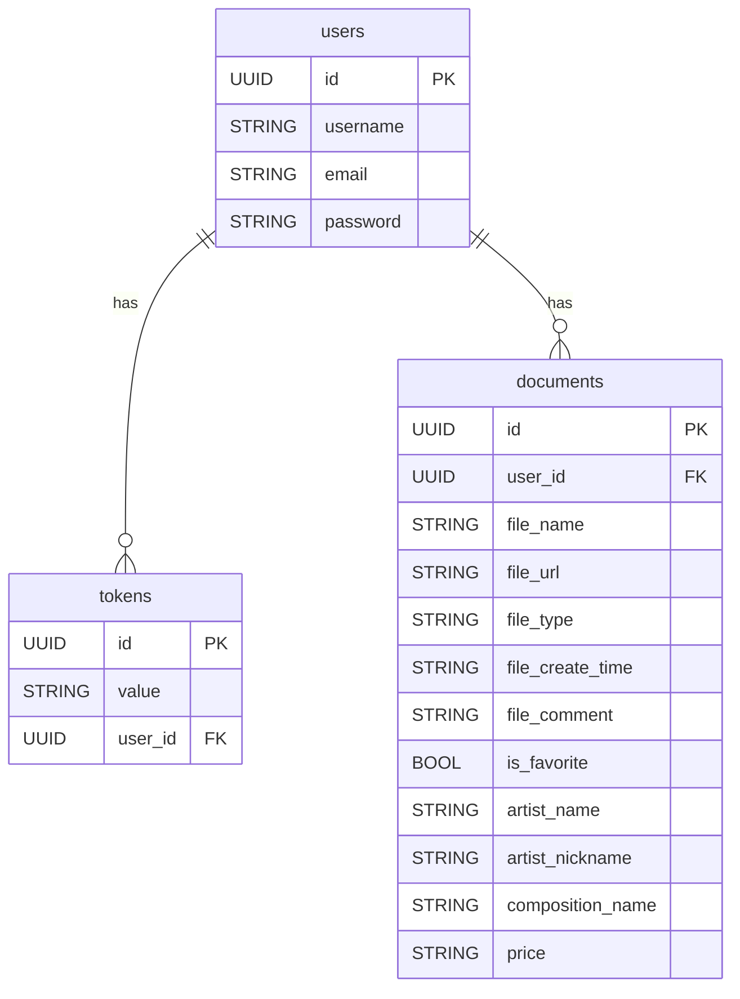

# API-Docs Swift Vapor

Vapor‑сервер для авторизации пользователей и управления PDF‑документами.
Дружит с PostgreSQL, Bearer токенами, умеет грузить файлы через `multipart/form‑data`.

Сервер был разработан для мобильного приложения [Docs](https://github.com/matveylogee/Docs).

## Возможности

* Регистрация и логин с базовой аутентификацией (Basic Auth) → выдаётся **Bearer‑токен**
* CRUD для **пользователей**
* Загрузка, скачивание и управление **PDF‑документами** (плюс «избранное» и комментарии)
* Юнит‑ и интеграционные тесты на `XCTest`

## Быстрый старт

### Запуск локально

```bash
git clone https://github.com/your‑name/your‑repo.git
open Package.swift
swift run
```

`.env` минимально:

```
DATABASE_HOST=localhost
DATABASE_PORT=5432
DATABASE_NAME=vapor_database
DATABASE_USERNAME=vapor_username
DATABASE_PASSWORD=vapor_password
```

Клиент открывается на **[http://localhost:8080](http://localhost:8080)**.

### Локальный запуск в Docker

```bash
docker run --name docs-api-db \
  -e POSTGRES_DB=vapor_database \
  -e POSTGRES_USER=vapor_username \
  -e POSTGRES_PASSWORD=vapor_password \
  -p 5432:5432 -d postgres:16-alpine
```

---

## Схема БД



## API

> Префикс каждой версии: **/api/v1**

### Аутентификация

| Метод | URL            | Назначение                  | Тело                            | Ответ   |
| ----- | -------------- | --------------------------- | ------------------------------- | ------- |
| POST  | /auth/register | Создать нового пользователя | `{ username, email, password }` | `Token` |
| POST  | /auth/login    | Получить токен авторизации  | Basic Auth                      | `Token` |

### Пользователи

| Метод | URL       | Назначение                   | Заголовок | Тело                               | Ответ    |
| ----- | --------- | ---------------------------- | --------- | ---------------------------------- | -------- |
| GET   | /users    | Список всех пользователей    | –         | –                                  | `[User]` |
| GET   | /users/me | Данные текущего пользователя | `Bearer`  | –                                  | `User`   |
| PUT   | /users    | Обновить профиль             | `Bearer`  | `{ username?, email?, password? }` | `User`   |

### Документы

| Метод  | URL                      | Назначение                     | Заголовок                       | Тело                        | Ответ        |
| ------ | ------------------------ | ------------------------------ | ------------------------------- | --------------------------- | ------------ |
| POST   | /documents               | Загрузить новый PDF-документ   | `Bearer`, `multipart/form-data` | `file` + `data { ... }`     | `Document`   |
| GET    | /documents               | Список документов пользователя | `Bearer`                        | –                           | `[Document]` |
| GET    | /documents/\:id          | Получить один документ         | `Bearer`                        | –                           | `Document`   |
| GET    | /documents/\:id/download | Скачать PDF-файл               | `Bearer`                        | –                           | PDF‑поток    |
| PUT    | /documents/\:id          | Обновить комментарий/избранное | `Bearer`                        | `{ comment?, isFavorite? }` | `Document`   |
| DELETE | /documents/\:id          | Удалить документ               | `Bearer`                        | –                           | 204          |
| DELETE | /documents               | Удалить все документы          | `Bearer`                        | –                           | 204          |

## Тестирование

* Полное покрытие Контроллеров и Сервисов интеграционными и Unit-тестами.
